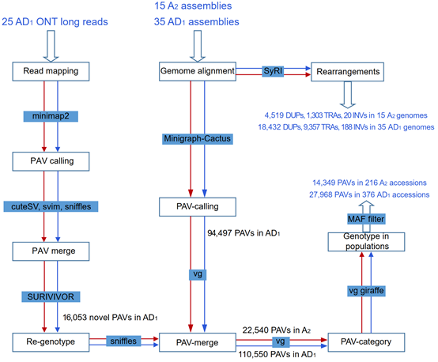
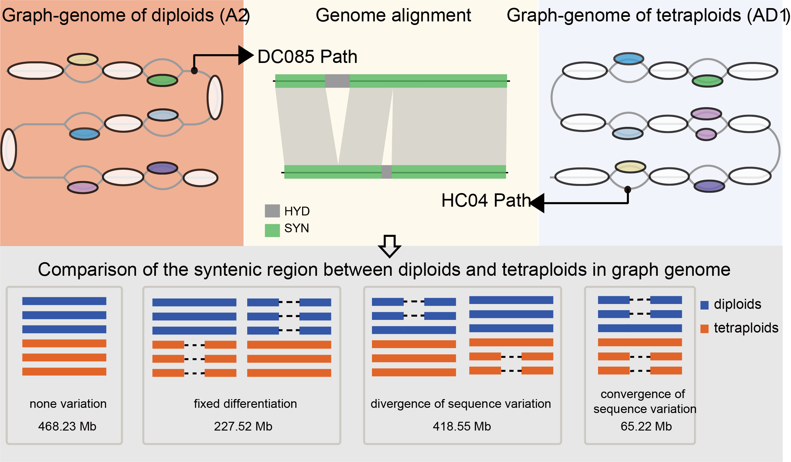

# Scripts used in cotton pan genome project

### Document description
+ `01_Genome assembly`  Genome assembly analysis
+ `02_PAV calling`  PVA calling process
+ `03_SNP calling`  SNP calling process
+ `04_GO Annotation`  GO annotation analysis
+ `05_Introgression block analysis`  Introgression block analysis
+ `06_Full-length LTR identification`  Full-length LTR identification
+ `07_Pan-genome construction` Pan-genome construction 
+ `08_RNA-seq analysis` Gene expression and PAV-eQTL analysis
+ `09_GWAS` PAV based GWAS analysis

*** 

### Pipeline for PAV calling

### Pipeline for pan-genome comparison

